# KinOS — Entity Relationship Diagram

The full DDL lives in `packages/db/migrations/`. Every table has RLS enabled;
`life_signal` is append-only (no update/delete grants + trigger backstop).

```mermaid
erDiagram
    app_user ||--o{ family_member : "belongs to families as"
    app_user ||--o{ auth_session : "signs in with"

    family_workspace ||--o{ family_member : has
    family_workspace ||--o{ care_subject : "holds Orbits"
    family_workspace ||--o{ invitation : issues
    family_workspace ||--o{ money_pot : funds
    family_workspace ||--o{ escalation_rule : configures
    family_workspace ||--o{ subscription : "is billed by"
    family_workspace ||--o{ usage_limit : "gated by"
    family_workspace ||--o{ activation_event : "instrumented by"
    family_workspace ||--o{ access_log : audits

    care_subject ||--o{ life_signal : "emits"
    care_subject ||--|| emergency_profile : "carries"
    care_subject ||--o{ emergency_contact : "reached via"
    care_subject ||--o{ medical_note : "annotated by"
    care_subject ||--o{ baseline_metric : "measured against"
    care_subject ||--o{ attention_event : "raises"
    care_subject ||--o{ pattern : "trends as"
    care_subject ||--o{ duty : "cared for through"
    care_subject ||--o{ medication : takes
    care_subject ||--o{ appointment : attends
    care_subject ||--o{ caregiver_visit : "visited in"
    care_subject ||--o{ family_record_item : "remembered in"
    care_subject ||--o{ daily_brief : "summarised by"
    care_subject ||--o{ emergency_alert : "protected by"
    care_subject ||--o{ consent_grant : "shared under"

    family_member ||--o{ consent_grant : "granted to"
    family_member ||--o{ duty : owns
    family_member ||--o{ notification : receives
    family_member ||--o{ push_subscription : "pushes to"
    family_member ||--o{ caregiver_visit : logs

    life_signal ||--o{ signal_interpretation : "interpreted as"
    life_signal ||--o{ attention_event : "may trigger"

    medication ||--o{ dose_log : "logged as"

    money_pot ||--o{ contribution : "credited by"
    money_pot ||--o{ expense : "debited by"
    money_pot ||--o{ ledger_entry : "balanced by"
    payment_intent ||--o{ contribution : settles

    family_record_item ||--o{ document : attaches
    family_record_item ||--o{ record_embedding : "indexed for recall"

    plan ||--o{ subscription : prices
```



## Privacy levels → who can read (enforced by RLS)

| Level | admin | member | caregiver | care_recipient | viewer | emergency |
|---|---|---|---|---|---|---|
| `family` | ✓ | ✓ | ✓ | ✓ | ✓ | ✓ |
| `caregiver_visible` | ✓ | — | with health/full consent | ✓ | — | — |
| `medical_private` | ✓ | with health/full consent | — | ✓ | — | — |
| `admin_only` | ✓ | with full consent | — | — | — | — |

Money tables: admins + members by role; anyone else only via a money/full
consent grant on the pot's subject. `emergency_profile` additionally opens
to the `emergency` role — that is its purpose.

## The signal pipeline

```
capture (user, RLS) → normalize (zod, engine) → interpret (rules | extract)
      → decide (baselines + attention rules, dedupe-keyed) → remember (pgvector)
      → notify (in-app / push / email; quiet hours; escalation ladder)
```

Failures at interpret/decide land in `pipeline_dead_letter`; the captured
signal itself is never lost.
